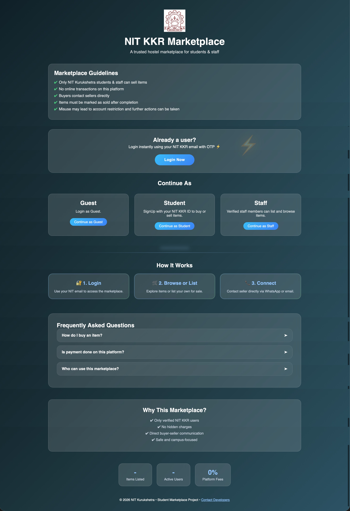
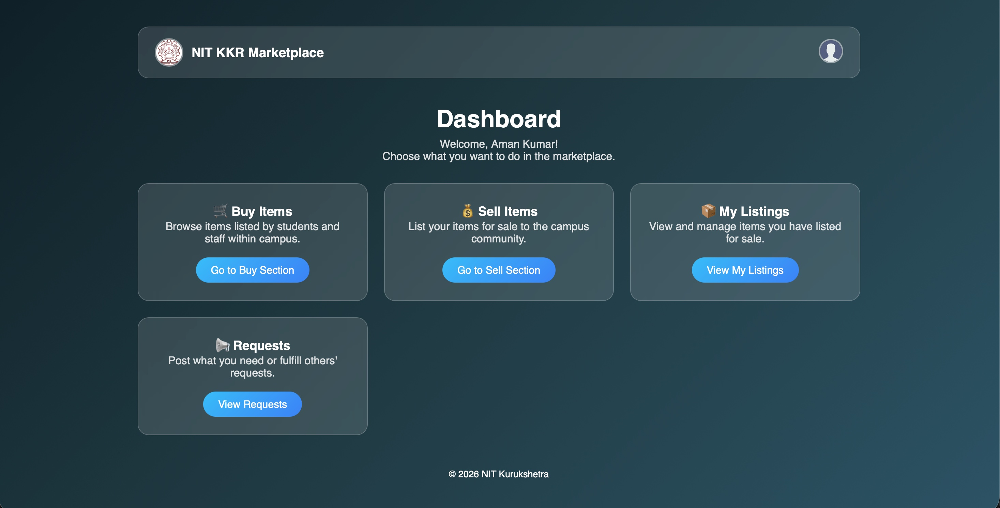
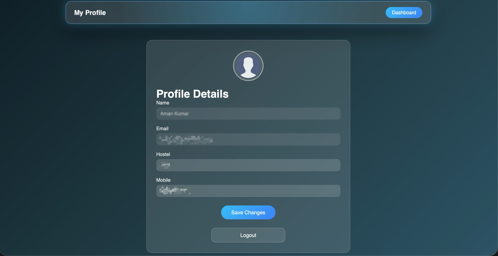

# 🏨 NIT Marketplace

<p align="center">

  

</p>

<p align="center">

  

  

  

  

</p>

---

## 📌 About The Project

**NIT Marketplace** is a student-focused marketplace built for hostel and campus students of NIT Kurukshetra.

Students often need to sell old books, cycles, electronics, room essentials, calculators, mattresses, and other items quickly.

This platform helps students:

- Buy useful items at lower prices

- Sell unused products easily

- Connect directly with buyers/sellers

- Trade securely inside campus

---

## 🚀 Live Website

🌐 **Visit Now:**  

https://nitkkr-marketplace.vercel.app

---

## ✨ Key Features

* 🛒 Buy and Sell Products Inside Campus
* 🔐 Student Login System
* 📊 User Dashboard
* 👤 Profile Management
* 📦 My Listings Section
* 📩 Product Requests Page
* 🏠 Marketplace Homepage
* 📱 Responsive Design
* ⚡ Fast Navigation
* 🎓 Built for NIT Kurukshetra Students
---

## 🎯 Use Cases

* Sell books after semester ends
* Buy second-hand electronics
* Purchase hostel essentials
* Exchange cycles, calculators, furniture, and more
* Connect with campus users easily

---
## 🎯 Why This Project Matters

Many students leave campus every semester and need to sell items urgently.

Instead of wasting products or using random groups, this website creates a structured campus marketplace.

---

## 🛠️ Tech Stack

### Frontend

- HTML

- CSS

- JavaScript

### Backend

- Node.js

- Express.js

### Database

- MongoDB (for Database)

- Cloudianry (For Images)

### Deployment

- Vercel (Frontend)

- Render (Backend)

### For Email OTP Services

- Resend

---

## 📸 Screenshots

### 🏠 Index Page



### 🔐 Dashboard Page



### 👤 Profile



## ⚙️ Run Locally

### 1️⃣ Clone Repository

```bash

git clone https://github.com/AmanKumar-05/nitkkr-marketplace.git

cd nitkkr-marketplace
```

### 2️⃣ Setup Backend

```bash

cd backend

npm install

npm start

```

### 3️⃣ Open Frontend

Open this file in your browser:

```text

frontend-project/index.html

```

---

## 📂 Project Structure

```text

root/
│── backend/
│   ├── jobs/
│   │   └── cleanup.js
│   │
│   ├── middleware/
│   │   └── auth.middleware.js
│   │
│   ├── models/
│   │   ├── Item.js
│   │   ├── Request.js
│   │   └── User.js
│   │
│   ├── routes/
│   │   ├── auth.js
│   │   ├── items.js
│   │   ├── requests.js
│   │   └── user.js
│   │
│   ├── utils/
│   │   ├── cloudinary.js
│   │   └── mailer.js
│   │
│   ├── .env
│   ├── package.json
│   ├── package-lock.json
│   └── server.js
│
│── frontend-project/
│   ├── css/
│   │   └── style.css
│   │
│   ├── js/
│   │   ├── api.js
│   │   ├── dashboard.js
│   │   ├── login.js
│   │   ├── main.js
│   │   ├── mylistings.js
│   │   ├── profile.js
│   │   └── sell.js
│   │
│   ├── buy.html
│   ├── contactdev.html
│   ├── dashboard.html
│   ├── guest.html
│   ├── index.html
│   ├── login-email.html
│   ├── login.html
│   ├── mylistings.html
│   ├── nitlogo.png
│   ├── profile.html
│   ├── requests.html
│   ├── sell.html
│   └── README.md
│
├── .DS_Store
└── README.md
```
## 🔐 Environment Variables

Create a `.env` file inside `backend/` using `.env.example` as reference.

---
## 👨‍💻 Developer

* Aman Kumar

---
## ⭐ Support

If you like this project, give it a star ⭐ on GitHub.

---
